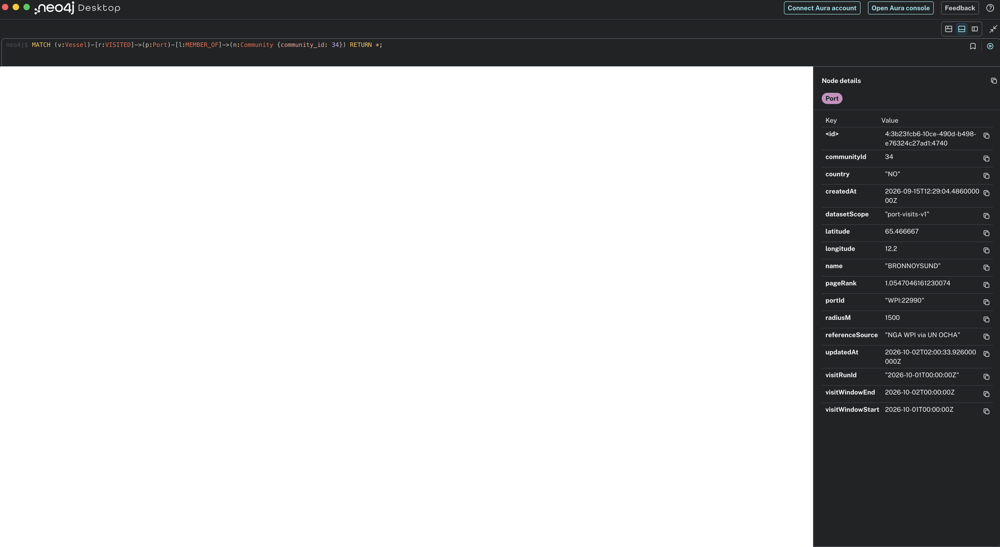
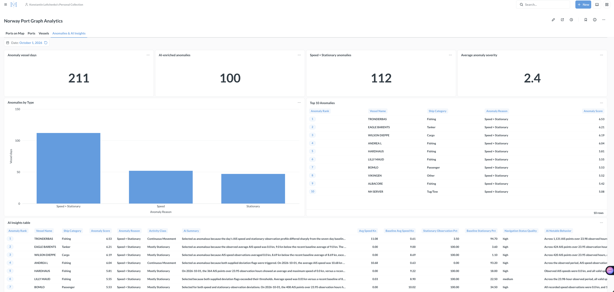

# AIS Graph Analytics

[](https://github.com/KonstantinLofichenko/ais-graph-analytics/actions/workflows/ci.yml)
[](https://github.com/KonstantinLofichenko/ais-graph-analytics/actions/workflows/release.yml)

AIS Graph Analytics is a portfolio data-engineering platform for live and historical AIS vessel data. It combines streaming ingestion, batch orchestration, analytical modeling, graph analytics, AI enrichment, dashboarding, automated testing, and versioned container releases in one reproducible project.

The project is intentionally multi-engine: ClickHouse keeps durable event history and analytical tables, Neo4j models vessel/port relationships and graph metrics, Kafka carries the live AIS stream, dbt owns analytical transformations, Airflow coordinates daily processing, and PyFlink computes near-real-time features and gap events.

## Architecture


[Zoomable SVG](docs/assets/architecture.svg) ·
[Diagram source and regeneration](docs/assets/README.md) ·
[Detailed architecture](docs/README.md#2-architecture)

### Three live paths

All live branches start with **BarentsWatch AIS → Python producer → Kafka
`ais.positions`**:

| Path | Processing and destination |
| --- | --- |
| Raw ingestion | ClickHouse Kafka Engine/materialized view → `raw.ais_positions`, the canonical historical event store. |
| Stateful stream processing | PyFlink gap detector → `ais.vessel.gaps` → `analytics.ais_vessel_gap_events`; PyFlink multi-window features → `ais.vessel.features` → `analytics.ais_vessel_features`. Both reach ClickHouse through Kafka Engine/materialized views. |
| Graph analytics | Kafka Connect → current Neo4j Vessel nodes; analytical port visits build `VISITED`/`CONNECTED_TO`, GDS PageRank/Louvain and `MEMBER_OF` communities → ClickHouse graph snapshots/dbt → BI, ML and AI inputs. |

ClickHouse retains history, Flink computes stateful events/windows, and Neo4j
complements the warehouse with current relationships and graph metrics. Metabase
reads **persistent ClickHouse tables**, including the two near-real-time tabs;
Kafka Engine tables and materialized views are ingestion infrastructure.
`activity_date` is derived in ClickHouse for storage/reporting, while live cards
use latest completed windows or rolling UTC time ranges.

### Supporting state recovery

Both PyFlink jobs checkpoint every 60 seconds to host-mounted
`./flink/checkpoints` (`/opt/flink/checkpoints` in containers). Recovery restores
Kafka offsets, gap ValueState/timers and partial feature windows. This gives
local-host durability across container restarts; it is not distributed HA or
protection from host/disk loss. EXACTLY_ONCE checkpoint state does not make the
Kafka/ClickHouse output exactly-once: replay can duplicate output records. See
[Flink configuration and recovery](flink/README.md#durable-checkpoints-and-restore).

### Historical ingestion: current and planned

The existing path loads HAIS GeoParquet through Airflow into `raw.hais_positions`,
then dbt normalizes and loads canonical `raw.ais_positions` history.
The **planned, undeployed lakehouse extension** is separate:

```text
HAIS GeoParquet → Airflow → PySpark → Iceberg → Trino
```

Flink continuously processes streams; this future batch path uses Airflow for
orchestration, PySpark for historical processing, Iceberg for lakehouse tables and
Trino for SQL queries. [Detailed historical architecture](docs/README.md#22-historical-path).

## What the project demonstrates

- **Streaming ingestion:** BarentsWatch AIS -> Kafka -> ClickHouse and Neo4j.
- **Stateful stream processing:** MMSI gap timers and sliding feature windows with durable checkpoint recovery.
- **Historical ingestion:** HAIS GeoParquet files loaded through Airflow into a canonical ClickHouse event model.
- **Analytical engineering:** dbt staging, marts, tests, seeds, and ClickHouse-specific modeling.
- **Graph analytics:** vessel/port graph processing with Neo4j, APOC, PageRank, Louvain communities, and graph snapshot export.
- **AI enrichment:** bounded, cache-aware OpenAI enrichment of daily vessel anomalies with full response history.
- **BI:** Metabase dashboards for ports, vessels, graph communities, anomalies, and AI insights.
- **CI:** isolated validation of configuration, Airflow/pipeline code, producer code, dbt + ClickHouse integration, and Kafka + Neo4j smoke behavior.
- **Release automation:** semantic Git tags build and publish project-owned Docker images to GitHub Container Registry and create a GitHub Release.

## Technology stack

| Area | Technology |
| --- | --- |
| Streaming | Apache Kafka 4.3.1, Kafka Connect, ksqlDB, Kafbat UI |
| Stateful stream processing | PyFlink 2.2.1 DataStream API |
| Storage / analytics | ClickHouse 26.3 |
| Transformation | dbt Core 1.12.5, dbt-clickhouse 1.10.3 |
| Orchestration | Apache Airflow |
| Graph | Neo4j 2026.07.1, APOC, Graph Data Science |
| BI | Metabase |
| AI enrichment | OpenAI API |
| Optional reference ingestion | Airbyte |
| CI/CD | GitHub Actions, GitHub Container Registry |
| Runtime | Docker Compose |

## Core analytical objects

| Object | Purpose |
| --- | --- |
| `raw.ais_positions` | Canonical AIS event history from live and historical sources |
| `raw.hais_positions` | Source-faithful HAIS historical landing table |
| `analytics.ais_vessel_features` | Flink-derived feature history by MMSI, window size and UTC boundaries |
| `analytics.ais_vessel_gap_events` | Flink-derived silence detection/recovery lifecycle history |
| `analytics.vessels` | Vessel identity and current analytical state |
| `analytics.vessel_daily_features` | Daily movement, speed, stationary, and navigation-status features |
| `analytics.vessel_daily_anomalies` | Deterministic daily anomaly candidates |
| `analytics.vessel_ai_enrichment` | Historical AI responses keyed by date/model/prompt/input hash |
| `analytics.vessel_daily_enriched` | Daily vessel analytics with current valid AI enrichment |
| `analytics.port_visits` | Port-visit history with logical tombstones for stale replacements |
| `analytics.port_graph_metrics` | Versioned graph metric snapshots |
| `analytics.port_graph_metrics_enriched` | Graph metrics enriched with reference dimensions |
| `analytics.port_graph_communities` | One row per graph community and activity date |

## Fresh-clone quick start

Run from the repository root in Bash.

### 1. Clone and configure

```bash
git clone https://github.com/KonstantinLofichenko/ais-graph-analytics.git
cd ais-graph-analytics
cp .env.example .env
mkdir -p data/hais
```

Set at least `NEO4J_PASSWORD` and `CLICKHOUSE_PASSWORD` in `.env`. For live AIS ingestion, also configure the BarentsWatch credentials. Keep secrets out of Git.

Kafka clients use `KAFKA_BOOTSTRAP_SERVERS` and `KAFKA_TOPIC`; the optional PyFlink
smoke job also requires `FLINK_SINK_TOPIC`. Use the Docker-internal broker address
from `.env.example` for Compose. See [Flink configuration and smoke validation](flink/README.md)
for host-side overrides and job commands.

Create the local Kafka Connect configuration:

```bash
cp neo4j/connectors/ais-sink.example.json neo4j/connectors/ais-sink.json
```

Set the connector password to the same Neo4j password and keep the Docker URI as `bolt://neo4j:7687`.

### 2. Start the core platform

```bash
docker compose up -d --wait --wait-timeout 300
./scripts/bootstrap.sh
./scripts/status.sh
```

Core Compose services include Kafka, Kafka Connect, ksqlDB, Kafbat UI, ClickHouse, and the customized Neo4j image.

`bootstrap.sh` creates/verifies the Kafka topic, applies additive ClickHouse migrations `003` through `010` and the lossless derived-stream migration/bootstrap, applies Neo4j constraints, and creates/updates the Kafka Connect sink.

Flink-derived feature windows and gap events are also ingested through Kafka Engine tables into persistent `analytics.ais_vessel_features` and `analytics.ais_vessel_gap_events` tables; see [ClickHouse streaming ingestion](clickhouse/README.md) for automatic bootstrap, schemas, monitoring, and example queries.

### 3. Optional profiles

```bash
# Live AIS producer
docker compose --profile live up -d --build ais-producer

# Airflow batch / daily analytics
docker compose --profile batch up -d --build --wait --wait-timeout 300 airflow

# Metabase
docker compose --profile analytics up -d metabase

# Both PyFlink jobs, with checkpoint storage and automatic submission
docker compose --profile streaming up -d
```

### 4. Configure dbt

```bash
python3.11 -m venv .venv-dbt
source .venv-dbt/bin/activate
python -m pip install -r dbt/requirements.txt
cp dbt/profiles.yml.example dbt/profiles.yml
export DBT_PROFILES_DIR="$PWD/dbt"
export CLICKHOUSE_USER=default
read -r -s -p 'ClickHouse password: ' DBT_ENV_SECRET_CLICKHOUSE_PASSWORD
printf '\n'
export DBT_ENV_SECRET_CLICKHOUSE_PASSWORD

dbt deps --project-dir dbt --profiles-dir dbt
dbt debug --project-dir dbt --profiles-dir dbt
```

### 5. Historical HAIS ingestion

Place completed files such as:

```text
data/hais/hais_2026-09-01.snappy.parquet
```

Trigger historical ingestion for the required date range, then normalize/load it into the canonical `raw.ais_positions` table. Historical file dates are inclusive; canonical-load end dates are exclusive UTC boundaries.

Follow the [HAIS ingestion guide](pipelines/hais/README.md) and then the
[dbt canonical-load workflow](dbt/README.md). The
[detailed project documentation](docs/README.md) explains architecture and operations.

## Daily orchestration

The master Airflow DAG is `daily_ais_pipeline` and is scheduled at **02:00 UTC**. It also supports an explicit `dag_run.conf.activity_date` for controlled reruns/backfills.

The daily master runs these tasks in order:

```text
resolve_activity_date -> dbt_core -> dbt_vessel_daily_features
  -> ais_port_visits -> ais_gds_metrics -> ais_graph_metrics_export
  -> dbt_graph_models -> dbt_vessel_daily_anomalies -> ai_enrichment
  -> dbt_vessel_daily_enriched -> dbt_tests
```

The activity day is captured once; graph child DAGs must be unpaused. See the
[Airflow guide](airflow/README.md#consolidated-daily-ais-pipeline) for retries,
historical runs and graph writer sequencing.

AI calls are outside the database. The enrichment pipeline uses deterministic input hashing and exact cache lookup so unchanged inputs do not generate duplicate API calls. Historical AI responses remain available for auditability.

## Graph model

Neo4j keeps the current graph state while ClickHouse retains historical analytical snapshots.

Representative graph structures include:

```text
(:Vessel)-[:VISITED]->(:Port)
(:Port)-[:CONNECTED_TO]->(:Port)
(:Port)-[:MEMBER_OF]->(:Community)
```

GDS calculations include PageRank and Louvain community detection. Community labels are deterministic and derived from representative high-PageRank ports. Graph history is exported back to ClickHouse for time-based analysis and Metabase reporting.

## Graph analytics with Neo4j

Neo4j stores the operational graph and graph-analysis results. Vessel visits
connect vessels to ports, while ports are grouped into communities discovered
through graph analytics.

The example below shows vessels, visited ports, and a detected port community.



## Metabase

The dashboard contains six tabs:

- **Ports on Map** — port map and a recovered-gap vessel ranking.
- **Ports** — port activity, PageRank and communities.
- **Vessels** — vessel identity, categories, navigation status and last positions.
- **Anomalies & AI Insights** — deterministic anomaly candidates and AI enrichment.
- **Near Real-Time Vessel Analytics** — latest Flink windows, activity and speed metrics.
- **Near Real-Time AIS Gap Monitoring** — detected/recovered gaps and silence durations.

The [dashboard guide and refreshed 31-card export](metabase/README.md) describe
sources, window selection, rolling UTC ranges and current filter mappings.

Technical snapshot identifiers remain in the storage model, but user-facing filtering is standardized around `activity_date` where applicable.

## Analytics dashboard

The Metabase dashboard provides an analytical view of vessel activity, port visits,
graph metrics, communities, anomalies, and AI-enriched insights.



This illustrative screenshot predates the two near-real-time tabs. Use the
[current dashboard guide and export](metabase/README.md) for the six-tab layout.

## CI

`.github/workflows/ci.yml` runs six independent jobs:

| Job | What it validates |
| --- | --- |
| Configuration | Shell syntax and Docker Compose configuration |
| Pipelines | Airflow image build plus isolated pipeline/DAG unit tests |
| Producer | Python unit tests plus AIS producer image build |
| dbt + ClickHouse | Fresh ClickHouse, init SQL, migrations, deterministic CI fixture, dbt seed/build/tests |
| ClickHouse + Kafka | Derived-topic ingestion, analytics ownership, vessel names and safe idempotent migration |
| Kafka + Neo4j | Kafka produce/consume smoke test and customized Neo4j startup/write/read/constraints |

CI does not call BarentsWatch, OpenAI, Airbyte, production Metabase, or a developer workstation.

## Releases and Docker images

A stable semantic tag triggers `.github/workflows/release.yml`:

```bash
git tag -a v1.0.3 -m "Release v1.0.3"
git push origin v1.0.3
```

The release workflow validates the tag/commit, runs CI, builds project-owned images, pushes them to GHCR, and creates a GitHub Release.

Published project images:

```text
ghcr.io/konstantinlofichenko/ais-graph-analytics-airflow
ghcr.io/konstantinlofichenko/ais-graph-analytics-producer
ghcr.io/konstantinlofichenko/ais-graph-analytics-neo4j
```

Stable releases receive version aliases such as:

```text
1.0.3
1.0
1
latest
```

Example:

```bash
docker pull ghcr.io/konstantinlofichenko/ais-graph-analytics-airflow:latest
docker pull ghcr.io/konstantinlofichenko/ais-graph-analytics-producer:latest
docker pull ghcr.io/konstantinlofichenko/ais-graph-analytics-neo4j:latest
```

The PyFlink image is built locally and is not currently published by the release workflow.

Third-party infrastructure images such as Kafka, ClickHouse, Metabase, and ksqlDB are referenced from their upstream registries and are not republished as project packages.

## Repository layout

```text
airflow/                 Airflow image, DAGs, and orchestration helpers
airbyte/                 Optional source/destination connector configuration
clickhouse/init/         Initialization and lossless derived-stream migration
clickhouse/migrations/   Additive schema/data migrations
dbt/                     Sources, seeds, staging models, marts, macros, tests
flink/                   PyFlink jobs, submitter, checkpoints, recovery tests
metabase/                Dashboard/card export/import assets
neo4j/                   Custom image, Cypher, constraints, GDS, connector config
pipelines/               Python processing pipelines
producers/ais/           Live BarentsWatch AIS producer
scripts/                 Bootstrap, CI, status, and operational helpers
.github/workflows/       CI and release automation
docs/                    Architecture and project documentation
```

## Important data semantics

- `raw.ais_positions` uses event time and `ReplacingMergeTree(ingested_at)`; logical validation should use `FINAL` when replacement convergence matters.
- Daily vessel stationary percentage is observation-based, not elapsed-time based.
- Navigation status is treated as noisy supporting data, not an unquestioned truth source.
- `port_visits.activity_date` and graph snapshot semantics use the pipeline UTC window start.
- Port visits and graph snapshots use logical tombstones for stale rows instead of destructive physical deletes.
- Neo4j represents current graph state; ClickHouse retains historical graph snapshots.

## Known limitation: visits across daily boundaries

Port-visit detection currently works on daily UTC windows. A physical stay that spans midnight can be represented as multiple daily visit fragments because detector state is not persisted across processing windows. That can slightly overcount visits and alter derived port-to-port graph metrics.

For a production implementation, use persistent detector state or detect physical visits over a continuous range before projecting them into daily analytics.

## Documentation

Start with:

- [Detailed project documentation](docs/README.md) and [Russian guide](docs/README.ru.md)
- [English PDF](docs/AIS-Graph-Analytics-ENG.pdf) and [Russian PDF](docs/AIS-Graph-Analytics-RUS.pdf)
- [Flink operations and recovery](flink/README.md)
- [ClickHouse streaming ingestion](clickhouse/README.md)
- [Metabase dashboard and exports](metabase/README.md)
- `airflow/README.md` - orchestration and Airflow usage
- `dbt/README.md` - dbt profiles, models, and loading procedures
- `pipelines/port_visits/README.md` - port-visit logic
- `pipelines/graph_metrics/README.md` - graph export and metrics
- `neo4j/gds/README.md` - manual graph analytics reference

## Project status

The current platform includes working live/historical ingestion, durable PyFlink streaming, ClickHouse/dbt analytics, Neo4j graph processing, AI enrichment, Metabase dashboards, automated CI, semantic releases, and GHCR publishing.

Planned learning extensions such as an Iceberg/MinIO/Trino lakehouse are intentionally **not** part of the current runtime yet.
