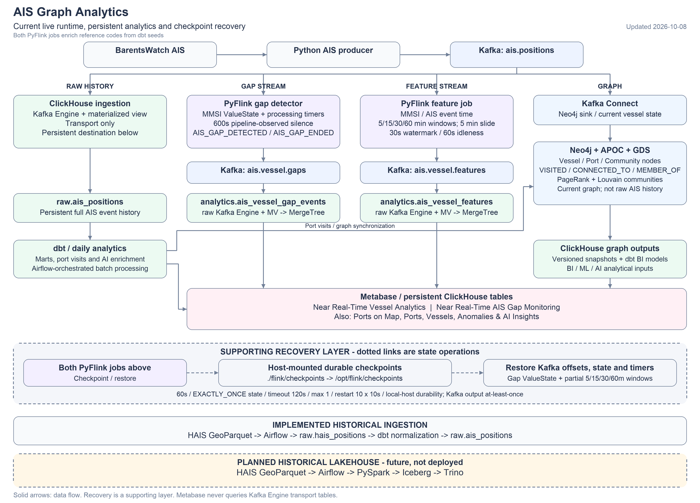

# AIS Graph Analytics - Detailed Project Documentation

This document is the operational and architectural companion to the repository
root `README.md`. It reflects the deployed streaming, analytical and graph
platform. The [English](AIS-Graph-Analytics-ENG.pdf) and
[Russian](AIS-Graph-Analytics-RUS.pdf) PDFs are regenerated from the current
English and [Russian Markdown](README.ru.md), using the shared architecture
asset. See [PDF regeneration](#pdf-regeneration) below. Documentation reviewed:
2026-10-08.

## 1. Platform overview

AIS Graph Analytics combines two ingestion modes:

- **Live:** BarentsWatch AIS -> Python producer -> Kafka.
- **Historical:** HAIS GeoParquet -> Airflow -> ClickHouse.

Both feed a canonical ClickHouse AIS history used by dbt analytical models. Neo4j stores graph/current-state structures, GDS produces graph metrics, OpenAI enriches selected daily vessel anomalies, and Metabase provides user-facing analytics.

The design separates responsibilities deliberately:

| Concern | System of record / primary engine |
| --- | --- |
| Raw event history | ClickHouse |
| Analytical transformations | dbt on ClickHouse |
| Current vessel graph state | Neo4j |
| Port/community graph analytics | Neo4j GDS + ClickHouse snapshots |
| Live transport | Kafka |
| Streaming windows and silence detection | PyFlink 2.2.1 |
| Batch/daily orchestration | Airflow |
| AI interpretation | External OpenAI enrichment pipeline |
| Visualization | Metabase |
| CI/CD | GitHub Actions + GHCR |

## 2. Architecture



[Zoomable SVG](assets/architecture.svg) · [Editable diagram and regeneration](assets/README.md).
Solid arrows carry data; the separate dotted recovery layer carries state
operations. The amber historical lakehouse path is explicitly planned.

### 2.1 Live path

```text
BarentsWatch
  -> producers/ais
  -> Kafka topic ais.positions
     -> ClickHouse Kafka Engine / materialized view -> raw.ais_positions
     -> Kafka Connect Neo4j sink -> current Vessel nodes
     -> PyFlink gap detector -> ais.vessel.gaps
        -> raw Kafka Engine / MV -> analytics.ais_vessel_gap_events
     -> PyFlink multi-window features -> ais.vessel.features
        -> raw Kafka Engine / MV -> analytics.ais_vessel_features
```

The producer uses MMSI as the Kafka key and preserves source AIS fields. These
are three distinct live paths: raw event history, stateful derived streams and
graph analytics. ClickHouse owns historical records; Flink owns continuous
stateful computation; the Neo4j sink merges current vessel state by MMSI. Graph
relationships and GDS metrics complement the warehouse rather than replacing it.

### 2.1.1 Flink derived analytics and recovery

```sh
docker compose --profile streaming up -d
docker compose logs -f flink-job-submitter
```

The duplicate-safe one-shot submitter starts both AIS jobs after Kafka,
JobManager, TaskManagers and task slots are ready. Both read one source topic,
`ais.positions`, keyed by MMSI, with their existing independent consumer groups.

- **Gap detector:** Flink ValueState and processing-time timers track the latest
  observation and active gap. After 600 seconds of pipeline-observed silence it
  emits `AIS_GAP_DETECTED`; the next observation emits `AIS_GAP_ENDED`, both to
  `ais.vessel.gaps`. Processing time is intentional: detection must work without
  new AIS event timestamps. Source AIS `msgtime` is preserved descriptively in
  the payload and does not drive the silence timer.
- **Feature job:** AIS `msgtime` supplies event time. A 30-second bounded
  out-of-orderness watermark and 60-second input idleness govern keyed sliding
  5/15/30/60-minute windows, with a five-minute slide. All branches emit to one
  topic, `ais.vessel.features`; `window_minutes` identifies the branch. Vessel
  name is the latest non-null name by event time, while navigation status and
  ship type come from the latest event-time observation, including null values.

The current production environment preserves:

```ini
FLINK_GAP_TIMEOUT_SECONDS=600
FLINK_FEATURE_WINDOWS_MINUTES=5,15,30,60
FLINK_FEATURE_SLIDE_MINUTES=5
FLINK_FEATURE_WATERMARK_SECONDS=30
FLINK_FEATURE_IDLE_SECONDS=60
FLINK_CHECKPOINT_INTERVAL_SECONDS=60
FLINK_CHECKPOINT_TIMEOUT_SECONDS=120
FLINK_CHECKPOINT_MIN_PAUSE_SECONDS=10
FLINK_CHECKPOINT_DIR=file:///opt/flink/checkpoints
FLINK_RESTART_ATTEMPTS=10
FLINK_RESTART_DELAY_SECONDS=10
```

Both jobs enrich reference codes from `dbt/seeds/ais_ship_types.csv` and
`dbt/seeds/ais_navigational_status.csv`. This shared reference data does not merge
the two jobs' independent timing or state semantics.

ClickHouse persists the derived streams in `analytics.ais_vessel_features` and
`analytics.ais_vessel_gap_events`; Kafka transport tables and views remain in
`raw`. The first column, `activity_date`, uses UTC window-end dates for features
and detection/end dates for gaps. Feature names use the latest non-null AIS name
by event time within each window. Kafka Engine tables and materialized views
stay in `raw` as ingestion infrastructure; the BI-facing destinations are
persistent MergeTree tables. `raw.ais_positions` is the canonical source-history
ReplacingMergeTree, with its replacement semantics documented below.
`activity_date` is a ClickHouse storage/reporting convenience, not a new Flink
payload field. Live Metabase cards use latest windows or rolling ranges rather
than this historical date filter.

Both jobs checkpoint every 60 seconds to gitignored `./flink/checkpoints`, mounted
at `/opt/flink/checkpoints` in all Flink services. Checkpoints use EXACTLY_ONCE
state mode, a 120-second timeout, ten-second minimum pause, one concurrent
checkpoint and retention on cancellation. Task failures use ten fixed-delay
retries ten seconds apart. After a full cluster restart, the submitter restores
missing jobs from retained checkpoints, including Kafka offsets, gap ValueState,
processing-time timers and partial feature windows. A fresh start without a
checkpoint instead begins at latest offsets. Without checkpoint restoration,
keyed state, timers and partial windows are lost after a complete cluster restart.
EXACTLY_ONCE applies to checkpointed
state, not full end-to-end delivery. Kafka sinks use `AT_LEAST_ONCE`; ClickHouse ingestion also remains
at-least-once, so replay can duplicate records. The local mount is not multi-host HA
or protection against host/disk loss, and Kafka must retain the checkpoint's
required offsets.

See the [Flink operations and recovery tests](../flink/README.md) and
[ClickHouse ingestion guide](../clickhouse/README.md). The 2026-10-08 recovery
validation passed a Flink-only restart and isolated state/timer/window tests;
Kafka, ClickHouse, Neo4j, Airflow and Metabase stayed running.

#### Startup, reconciliation and manual restore

The submitter polls JobManager readiness, two registered TaskManagers, Kafka
protocol connectivity and sufficient free slots. Each missing job needs one slot
at the current parallelism of one. The shared registry and file lock record fixed
Job IDs before submission, preventing duplicate submissions across retries and
concurrent clients. Transitional jobs are tracked by ID; legacy jobs are adopted
using their name plus source/operator plan. Only missing jobs are submitted with
`--pyFiles /opt/flink/jobs`; exit code 0 confirms both are RUNNING.

```sh
# Reconcile without restarting other services.
docker compose --profile streaming run --rm --no-deps flink-job-submitter
# Explicit Flink-only restart invokes the submitter via depends_on restart:true.
docker compose --profile streaming restart \
  flink-jobmanager flink-taskmanager flink-feature-taskmanager
```

The submitter is a one-shot startup client. After an abrupt Docker failure,
rerun Compose startup/reconciliation; it is not a continuous supervisor. In-cluster
failures use the Flink restart strategy. Complete cluster loss requires submission
with a retained snapshot. The submitter selects finalized checkpoint metadata,
uses `-s` with `-claimMode NO_CLAIM`, and fails on an invalid restore rather than
silently discarding state. If no snapshot exists, it warns and starts fresh.

Manual restore is for an absent job only; replace the placeholders with a real
completed checkpoint. Use the features directory and Python file for the other job.

```sh
docker compose exec -T flink-jobmanager /opt/flink/bin/flink run -d \
  -s file:///opt/flink/checkpoints/gap/<job-id>/chk-<id>/_metadata \
  -claimMode NO_CLAIM --pyFiles /opt/flink/jobs \
  -py /opt/flink/jobs/ais_gap_detector.py
```

### 2.2 Historical path

```text
HAIS GeoParquet files
  -> Airflow historical ingestion
  -> raw.hais_positions
  -> dbt staging normalization
  -> canonical load macro
  -> raw.ais_positions
```

The HAIS landing layer is intentionally source-faithful. Normalization happens before loading into the canonical AIS table.

#### Planned historical lakehouse extension

```text
HAIS GeoParquet → Airflow → PySpark → Iceberg → Trino
```

This extension is **planned/future and not deployed**. HAIS and Airflow are already
used in the existing ClickHouse ingestion path; PySpark, Iceberg and Trino are the
future lakehouse components. Flink is not part of this batch path.

| Component | Architectural role |
| --- | --- |
| Flink (current live path) | Continuous stateful stream processing. |
| Airflow (current and planned paths) | Scheduling, dependencies and orchestration. |
| PySpark (planned) | Distributed historical/batch processing. |
| Iceberg (planned) | Lakehouse table format. |
| Trino (planned) | SQL query layer over lakehouse tables. |

### 2.3 Analytical / graph path

```text
raw.ais_positions
  -> dbt vessel models
  -> daily features
  -> deterministic anomalies
  -> AI enrichment history
  -> daily enriched vessel view

raw.ais_positions
  -> port visit detection
  -> Neo4j port graph
  -> PageRank + Louvain
  -> ClickHouse graph snapshots
  -> Metabase
```

Kafka Connect supplies current Vessel nodes; the analytical port-visit workflow
builds Vessel-to-Port `VISITED` and Port-to-Port `CONNECTED_TO` relationships.
GDS PageRank and Louvain derive importance and communities, represented by
Port-to-Community `MEMBER_OF` relationships. Exported graph snapshots in ClickHouse
and dbt models are reusable BI/ML/AI analytical inputs. Metabase reads those
persisted outputs, not Neo4j as a replacement raw-history store. See the
[graph pipeline](../pipelines/graph_metrics/README.md).

## 3. Docker runtime

### 3.1 Compose profiles

| Profile | Main service | Use |
| --- | --- | --- |
| none | Kafka, Kafka Connect, ksqlDB, Kafbat UI, ClickHouse, Neo4j | Core runtime |
| `live` | AIS producer | Continuous BarentsWatch ingestion |
| `batch` | Airflow | Historical and daily analytics |
| `analytics` | Metabase | BI/dashboarding |
| `streaming` | Flink JobManager, two TaskManagers, checkpoint initializer and submitter | Stateful live features/gaps and recovery |

### 3.2 Project-owned images

The release workflow publishes three images to GHCR:

```text
ghcr.io/konstantinlofichenko/ais-graph-analytics-airflow
ghcr.io/konstantinlofichenko/ais-graph-analytics-producer
ghcr.io/konstantinlofichenko/ais-graph-analytics-neo4j
```

The Flink image is built locally and is not currently included in GHCR releases.

The Neo4j image is customized because the project adds ClickHouse JDBC support on top of the upstream Neo4j image. Temporary `*-ci` image names are test artifacts and are not release packages.

### 3.3 Third-party images

Kafka, ClickHouse, Metabase, ksqlDB, Kafbat UI, and other upstream infrastructure are referenced directly from their official registries. They are intentionally not republished as project-owned packages.

## 4. Fresh installation

### 4.1 Repository and environment

```bash
git clone https://github.com/KonstantinLofichenko/ais-graph-analytics.git
cd ais-graph-analytics
cp .env.example .env
mkdir -p data/hais
```

Configure local secrets in `.env`. At minimum, set ClickHouse and Neo4j credentials. Configure BarentsWatch credentials only when live ingestion is required.

Never commit `.env`, connector passwords, or expanded configuration output that contains secrets.

### 4.2 Kafka Connect local config

```bash
cp neo4j/connectors/ais-sink.example.json neo4j/connectors/ais-sink.json
```

Use:

```text
bolt://neo4j:7687
```

inside Docker. `localhost` from Kafka Connect refers to the Kafka Connect container itself and is therefore incorrect for Neo4j access.

### 4.3 Start core services

```bash
docker compose up -d --wait --wait-timeout 300
docker compose ps
```

### 4.4 Bootstrap

```bash
./scripts/bootstrap.sh
```

The bootstrap script:

1. Validates local connector configuration.
2. Creates/verifies Kafka topic `ais.positions`.
3. Creates/migrates the Flink-derived analytical tables without dropping legacy history, then applies additive ClickHouse migrations `003` through `010`.
4. Applies Neo4j constraints.
5. Creates/updates the Neo4j Kafka sink connector.

Migration `001_replacing_ais_positions.sql` is an existing-installation migration and is intentionally not part of fresh bootstrap.

## 5. ClickHouse data model

### 5.1 Canonical raw AIS

`raw.ais_positions` is the canonical durable event table. It is optimized for vessel/time access and uses event-time monthly partitions.

Important semantics:

- key analytical access: `(mmsi, msgtime)`;
- version column: `ingested_at`;
- engine: `ReplacingMergeTree(ingested_at)`;
- use `FINAL` for logical validation when replacement convergence matters;
- live and historical sources can overlap, so source coverage should be reviewed before large backfills.

### 5.2 Historical HAIS

`raw.hais_positions` preserves HAIS source values for auditability. dbt staging normalizes source details before canonical loading.

### 5.3 Derived stream history

| Kafka topic | Persistent destination | ClickHouse consumer group |
| --- | --- | --- |
| `ais.vessel.features` | `analytics.ais_vessel_features` | `clickhouse_ais_vessel_features` |
| `ais.vessel.gaps` | `analytics.ais_vessel_gap_events` | `clickhouse_ais_vessel_gaps` |

Both destinations are MergeTree tables. Their Kafka Engine tables and materialized
views remain in `raw`; BI reads persistent destinations. `activity_date` is the
first column: features use `toDate(window_end)`; gaps use `toDate(gap_detected_at)`
for AIS_GAP_DETECTED and `toDate(gap_ended_at)` for AIS_GAP_ENDED, all in UTC.
DEFAULT expressions apply to old history without a full rewrite. Historical
feature names absent from the original payload remain NULL.

The derived bootstrap script uses RENAME to preserve legacy table UUIDs/history
when moving from `raw` to `analytics`. Conflicting old/new destinations fail before
migration. Views are retargeted and reruns do not copy data again. ClickHouse DDL
uses literal topics and `ais-kafka:29092`; it does not dynamically read `.env`.
Changing Flink topics alone therefore requires a matching ingestion DDL change.
See the [schema and monitoring guide](../clickhouse/README.md).

### 5.4 Port visits and graph history

`analytics.port_visits` and `analytics.port_graph_metrics` use replacement/tombstone semantics. Stale logical records are marked with newer deleted versions rather than physically removed.

Downstream consumers must use the logical active state (`FINAL` plus the active/deleted filter where required).

## 6. dbt

### 6.1 Environment

```bash
python3.11 -m venv .venv-dbt
source .venv-dbt/bin/activate
python -m pip install -r dbt/requirements.txt
cp dbt/profiles.yml.example dbt/profiles.yml
export DBT_PROFILES_DIR="$PWD/dbt"
export CLICKHOUSE_USER=default
read -r -s -p 'ClickHouse password: ' DBT_ENV_SECRET_CLICKHOUSE_PASSWORD
printf '\n'
export DBT_ENV_SECRET_CLICKHOUSE_PASSWORD

dbt deps --project-dir dbt --profiles-dir dbt
dbt parse --project-dir dbt --profiles-dir dbt
dbt debug --project-dir dbt --profiles-dir dbt
```

Current pinned versions are dbt Core `1.12.5` and `dbt-clickhouse` `1.10.3`.

### 6.2 Important models

| Model | Role |
| --- | --- |
| `vessels` | Vessel identity/current analytical state |
| `vessel_daily_features` | Daily movement and quality features |
| `vessel_daily_anomalies` | Deterministic anomaly selection |
| `vessel_daily_enriched` | Daily features + valid current AI enrichment |
| `current_port_visits` | Logical current active port visits |
| `port_graph_metrics_enriched` | Graph metrics with reference dimensions |
| `port_graph_communities` | Community-level reporting table |

Static AIS ship-type and navigation-status mappings are dbt seeds, not ad-hoc SQL embedded throughout models.

## 7. Historical AIS processing

Historical files are manually placed in `data/hais` with names such as:

```text
hais_2026-09-01.snappy.parquet
```

The historical Airflow ingestion records audit/retry status. After successful source ingestion, dbt staging plus the canonical-load macro populates `raw.ais_positions`.

Date convention:

| Operation | Start | End |
| --- | --- | --- |
| HAIS file ingestion | Inclusive | Inclusive |
| Canonical dbt load | Inclusive | Exclusive UTC midnight |
| Daily analytics | Activity date / UTC window start | Next UTC boundary |

Avoid uncontrolled overlapping re-loads: the canonical table can converge duplicate versions, but backfills can still replace attributes such as vessel names/types if the historical source is less complete than live data.

## 8. Daily Airflow orchestration

The main DAG is:

```text
daily_ais_pipeline
```

Schedule:

```text
02:00 UTC daily
```

An explicit `dag_run.conf.activity_date` can be used for deterministic reruns/backfills.

The daily orchestration coordinates the analytical chain rather than treating dbt, AI, graph, and dashboard data as independent manual jobs.

The actual task order is:

```text
resolve_activity_date -> dbt_core -> dbt_vessel_daily_features
  -> ais_port_visits -> ais_gds_metrics -> ais_graph_metrics_export
  -> dbt_graph_models -> dbt_vessel_daily_anomalies -> ai_enrichment
  -> dbt_vessel_daily_enriched -> dbt_tests
```

The date is captured once from an explicit activity_date or yesterday UTC at
master start. Child graph DAGs must be unpaused; their trigger tasks wait for
success. Country-dependent graph enrichment remains optional. See
[Airflow operations](../airflow/README.md#consolidated-daily-ais-pipeline).

Historical backfills should be sequential where graph/current-state updates are involved.

## 9. AI enrichment

### 9.1 Purpose

AI is used to summarize selected anomalous vessel-days, not to replace deterministic feature engineering or anomaly selection.

### 9.2 Cache and history

`analytics.vessel_ai_enrichment` retains response history including model, prompt version, exact input hash, token counts, response ID, and creation time.

The lookup requires an exact match of the relevant input identity, including date/model/prompt/input hash. This avoids presenting stale enrichment after source features change while preserving historical responses for auditability.

### 9.3 Bounded calls

`AI_ENRICHMENT_LIMIT` limits **new** API calls after cache hits are removed. CI does not make live OpenAI calls.

## 10. Neo4j and graph analytics

### 10.1 Current state vs history

Neo4j represents the current graph state. ClickHouse stores time-versioned graph snapshots for historical analysis.

### 10.2 Main relationships

```text
(Vessel)-[:VISITED]->(Port)
(Port)-[:CONNECTED_TO]->(Port)
(Port)-[:MEMBER_OF]->(Community)
```

### 10.3 GDS

The graph workflow includes:

- PageRank for port importance;
- Louvain for community detection;
- deterministic community naming/labels based on representative ports;
- export of graph metrics to ClickHouse.

Community reporting is standardized around human-readable names while retaining the technical community ID for traceability.

## 11. Metabase

The main dashboard contains six tabs:

1. **Ports on Map** — port map and a recovered-gap vessel ranking.
2. **Ports** — centrality and community analytics.
3. **Vessels** — vessel activity, categories and last-known positions.
4. **Anomalies & AI Insights** — daily anomaly candidates and AI enrichment.
5. **Near Real-Time Vessel Analytics** — latest completed 5/15/30/60-minute
   Flink feature windows, active vessels, speeds, categories and navigation status.
6. **Near Real-Time AIS Gap Monitoring** — detected/recovered gaps over the last
   hour, and vessel rankings, durations and latest events over the last 24 hours.

The refreshed [Metabase export and guide](../metabase/README.md) contains all 31
saved cards, layout, tabs, filters and mappings. The Window minute selector is
mapped to feature cards 58–62; the features details table currently uses its own
five-minute default. The new rolling/latest queries are independent of the
historical Date and Last Seen filters. Historical cards use business
`activity_date` semantics where applicable.

## 12. CI

The CI workflow is intentionally isolated from external services and local developer state.

### 12.1 Jobs

| Job | Validation |
| --- | --- |
| Shell and Compose | Shell syntax and all Compose profiles |
| Pipeline tests | Airflow image + isolated DAG/pipeline tests |
| Producer | Python producer tests + image build |
| dbt + ClickHouse | Fresh ClickHouse, init, migrations, CI fixture, seeds, selected model/test graph |
| ClickHouse + Kafka | Derived-topic ingestion, analytics ownership, names and idempotent migration |
| Kafka + Neo4j | Kafka topic/produce/consume + custom Neo4j startup/constraints/write/read |

### 12.2 CI source fixture

The dbt integration test creates a deterministic `raw.countries` fixture only for CI because production `raw.countries` is normally owned by optional Airbyte ingestion. The fixture must remain CI-only and should not be added to normal production initialization.

### 12.3 External calls deliberately excluded

CI does not depend on:

- BarentsWatch;
- OpenAI;
- Airbyte control plane;
- a running local Mac environment;
- production Metabase.

This makes pull-request checks deterministic and reproducible.

## 13. Release workflow

A stable semantic tag matching `vMAJOR.MINOR.PATCH` triggers release automation.

Example:

```bash
git tag -a v1.0.3 -m "Release v1.0.3"
git push origin v1.0.3
```

The workflow:

1. Validates semantic version format.
2. Verifies the release commit belongs to `main`.
3. Runs the reusable CI workflow.
4. Builds the Airflow, producer, and custom Neo4j images.
5. Pushes versioned images to GHCR.
6. Creates a GitHub Release with generated notes.

Stable image tags include:

```text
MAJOR.MINOR.PATCH
MAJOR.MINOR
MAJOR
latest
```

Do not move an already-published release tag. Use a new patch/minor/major version instead.

## 14. Published containers

```bash
docker pull ghcr.io/konstantinlofichenko/ais-graph-analytics-airflow:latest
docker pull ghcr.io/konstantinlofichenko/ais-graph-analytics-producer:latest
docker pull ghcr.io/konstantinlofichenko/ais-graph-analytics-neo4j:latest
```

Only project-owned images are published. Third-party images remain referenced from upstream registries.

## 15. Validation and operations

Useful project checks:

```bash
./scripts/status.sh
docker compose ps
docker compose logs --tail 100 airflow
docker compose logs --tail 100 ais-producer
docker compose logs --tail 100 neo4j
```

Kafka topic inspection and Flink readiness:

```bash
docker compose exec -T ais-kafka /opt/kafka/bin/kafka-topics.sh --bootstrap-server ais-kafka:29092 --list
curl -fsS http://localhost:8082/jobs/overview
docker compose logs --tail 100 flink-job-submitter
```

For each running job, inspect `/jobs/<job-id>/checkpoints` before a Flink-only
restart. See the [Flink recovery procedures](../flink/README.md#durable-checkpoints-and-restore).

Logical ClickHouse validation should prefer `FINAL` where ReplacingMergeTree replacement semantics matter.

## 16. Important data-quality semantics

- Ship type/name coverage depends on the source; source NULLs should not be silently presented as fabricated identities.
- AIS navigation status can be noisy; it is supporting evidence rather than a definitive motion label.
- Speed metrics exclude implausible values using the configured validity threshold.
- Stationary percentage is based on observations, not continuous elapsed-time interpolation.
- AI summaries describe the engineered inputs they receive; they do not establish behavior between AIS observations.
- Graph community IDs are technical identifiers; labels/names are user-facing descriptions.

## 17. Known limitation: midnight visit fragmentation

Port-visit detection processes bounded UTC windows. If one physical stay crosses midnight, it can appear as separate daily visit fragments because state is not persisted across daily windows.

Impact:

- possible visit overcounting;
- fragmented duration;
- small downstream differences in graph connections/metrics.

Production-grade alternatives are persistent detector state or continuous physical-visit detection followed by daily projection.

## 18. Troubleshooting

### Container name conflict

```bash
docker ps -a
```

Remove only obsolete AIS test/manual containers. Do not blindly delete project volumes.

### Kafka Connect cannot reach Neo4j

Use `bolt://neo4j:7687`, not `localhost`, inside Docker.

### ksqlDB or Kafka Connect healthchecks

The Confluent images used by this project do not rely on `curl` for these healthchecks; the Compose configuration uses TCP checks where appropriate.

### Neo4j custom image

The project-owned Neo4j image includes the ClickHouse JDBC JAR and is tested in CI with the plugin environment used by the normal Compose service.

### dbt cannot connect

Confirm:

- dbt virtual environment is active;
- `DBT_PROFILES_DIR` points to the project dbt directory;
- `DBT_ENV_SECRET_CLICKHOUSE_PASSWORD` matches the local ClickHouse password;
- host/port are correct for the environment being tested.

## 19. Safe shutdown and cleanup

Stop services without deleting named volumes:

```bash
docker compose --profile live --profile batch --profile analytics --profile streaming down
```

Do **not** add `-v` if data must be retained.

Temporary local CI images can be removed when no longer needed:

```bash
docker images --format '{{.Repository}}:{{.Tag}}' | grep -- '-ci'
```

Delete only disposable test images, not the project runtime images or upstream dependencies you still use.

## 20. Repository documentation map

| Path | Purpose |
| --- | --- |
| `README.md` | Project overview and quick start |
| `docs/README.md`, `docs/README.ru.md` | English/Russian operational and architectural sources |
| `docs/assets/README.md` | Shared diagram and regeneration |
| `pipelines/hais/README.md` | HAIS ingestion and audit/recovery |
| `pipelines/historic_ais/README.md` | Historic REST repair/backfill |
| `airbyte/README.md` | Optional country enrichment exports |
| `data/ports/README.md` | Dated pilot port reference |
| `airflow/README.md` | Airflow-specific setup and orchestration |
| `dbt/README.md` | dbt configuration and transformations |
| `pipelines/port_visits/README.md` | Port-visit implementation |
| `pipelines/graph_metrics/README.md` | Graph metric export |
| `neo4j/gds/README.md` | GDS workflows |
| `flink/README.md` | Streaming jobs, durable checkpoints and recovery |
| `clickhouse/README.md` | Derived-topic ingestion and analytics tables |
| `metabase/README.md` | Six-tab dashboard and export/import workflow |

## 21. Current status and roadmap

Current implementation includes:

- live + historical AIS ingestion;
- canonical ClickHouse history;
- dbt analytical models/tests;
- Airflow scheduled orchestration;
- Neo4j graph analytics;
- deterministic anomaly selection;
- AI enrichment with cache/history;
- durable Flink feature windows and gap detection;
- six-tab Metabase dashboarding;
- six-job CI;
- semantic GitHub Releases;
- GHCR publishing for Airflow, producer and custom Neo4j images. Flink is a local build.

Planned learning extensions such as PySpark, MinIO, Iceberg, Trino, and `dbt-trino` are future work and should not be described as part of the current deployed runtime until implemented.


## PDF regeneration

The English PDF is generated from this guide; the Russian PDF uses
[README.ru.md](README.ru.md). Update both sources when platform behavior changes.
Both embed the same [architecture diagram](assets/README.md). PDFs describe the
reviewed implementation; runtime screenshots and dated validation results retain
their explicit snapshot dates.

```sh
python3 -m venv /tmp/ais-docs-venv
/tmp/ais-docs-venv/bin/pip install reportlab pillow pymupdf
/tmp/ais-docs-venv/bin/python docs/render_pdfs.py
```

The renderer uses Arial on macOS or DejaVu fonts on Linux and writes the two
existing PDF paths. Regenerate the architecture first if its source changed.
Render every PDF page for visual review after changes; verify links, Cyrillic,
tables, code wrapping and checkpoint/delivery limitations before sharing.
